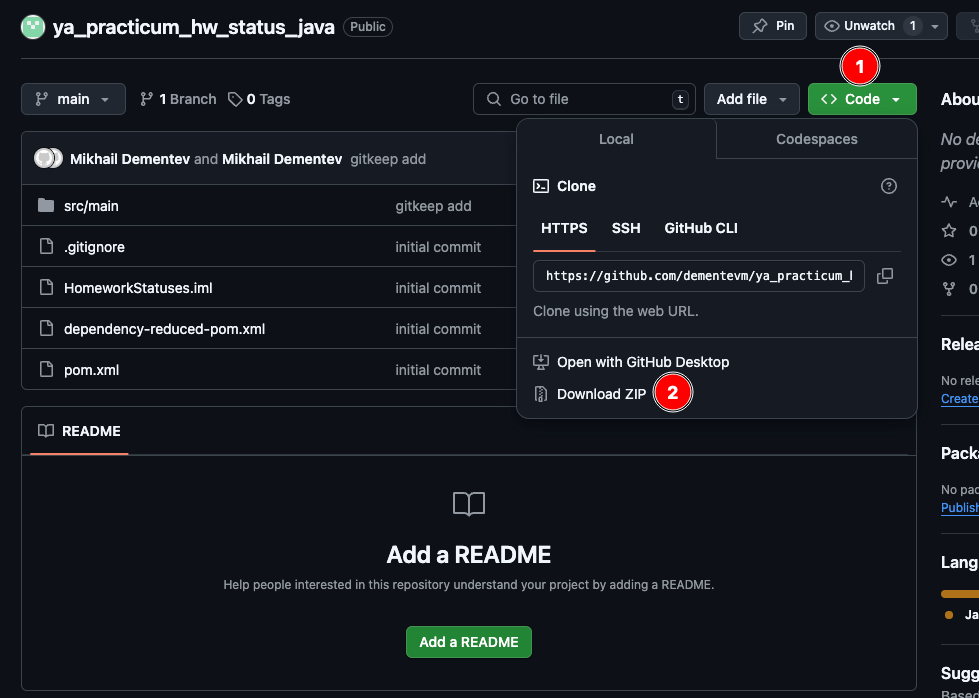
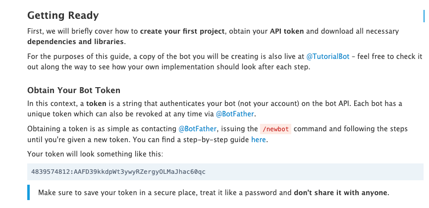
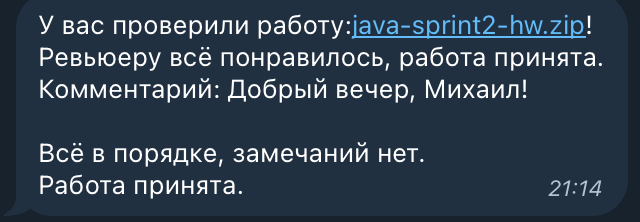

# Homework Bot

Это мини-проект на Java для проверки статусов финальных проектов яндекс практикума. Проект собирается с помощью Maven и использует библиотеку Gson для разбора JSON-ответов.

**Важно:** Все секреты (например, API-ключи, пароли) должны храниться **только** в файле `config.properties`. Никогда не коммитьте этот файл в публичный репозиторий!

## Предварительные требования

- **Java JDK 11 или выше** – проверьте командой:
  ```bash
  java -version
- **Maven**:
  [Инструкция по установке Maven](https://habr.com/ru/articles/789344/)

## Для скачивания проекта надо воспользоваться Git
- **[Инструкция по установке Git](https://git-scm.com/book/ru/v2/%D0%92%D0%B2%D0%B5%D0%B4%D0%B5%D0%BD%D0%B8%D0%B5-%D0%A3%D1%81%D1%82%D0%B0%D0%BD%D0%BE%D0%B2%D0%BA%D0%B0-Git)**
### после чего перейти в директорию в которую вы хотите скачать проект используя команду CD, например:
- **Для Windows: нажмите сочетание клавиш Win+R, введите команду CMD и нажмите Enter**
- Выполните следующую команду:
```bash
  cd C:\my_folder\Dev
```
- **Для Linux\Mac перейдите в терминале в директорию следующей командой:**
```bash
  cd ~/my_folder/Dev
```
Указанный выше путь - должен быть реально существующим.
- **Затем выполните команду**
```bash
  git clone https://github.com/dementevm/ya_practicum_hw_status_java.git
```

### Либо просто скачайте и распакуйте архив с файлами из репозитория:


## Получение токенов и chat_id.

### 1. Создание телеграм бота
[Инструкция по созданию телеграм бота](https://core.telegram.org/bots/tutorial)

### 2. Конкретно нас интересует эта часть, нам нужен токен нашего бота:


### 3. Также нам необходимо узнать наш CHAT_ID в телеграмме. Для этого можно написать в телеграмме боту @getmyid_bot. Нам нужна строчка с: Your user ID: *Цифры*

### 4. Получения API-ключа Яндекс-Практикума
[Адрес для получения токена Яндекс-Практикумы](https://oauth.yandex.ru/authorize?response_type=token&client_id=1d0b9dd4d652455a9eb710d450ff456a)


## Запуск проекта
### 1. В папке src/main/resources создайте файл ```config.properties``` В этом файле мы будем хранить наши включи.

## *ВНИМАНИЕ. НИКОГДА* не храните пароли и ключи в самом коде в открытом виде.
### заполните ```config.properties``` следующими данными:
```
PRACTICUM_TOKEN=токен_яндекс_практикума
CHAT_ID=ваш_chat_id_телеграмма
BOT_TOKEN=токе_бота_в_телеграмме
```
### 2. В папке проекта выполните следующую команду:
```bash
  mvn clean package
```
### 3. Запустите проект с помощью команды:
```bash
  java -jar target/homework-check-1.0-SNAPSHOT.jar
```

### Если все прошло успешно, бот в телеграмме пришлет вам сообщение о том что он запустился. Статусы работ проверяются автоматически, каждые 5 минут.
